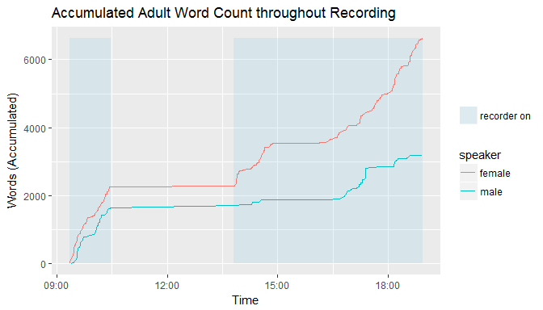

<!-- README.md is generated from README.Rmd. Please edit that file -->
rlena
=====

[](http://www.repostatus.org/#wip) [](https://travis-ci.org/Teebusch/rlena) [](https://coveralls.io/github/Teebusch/rlena?branch=master)

Overview
--------

The `rlena` package makes it easy to work with LENA `.its` files in R.

The *Language Environment ANalysis (LENA)* system produces automatic annotations for audio recordings. Its annotations can be exported as `.its` files, that contain an `xml` structure. The `rlena` package helps with importing `.its` files into R and with creating and producing tidy data frames for further analysis.

The `read_its_file()` fuction takes the path to an .its file and returns an XML object.

All other functions work with this object to extract information:

-   `gather_ava_info()` returns the AVA (Automatic Vocalization Assessment).
-   `gather_child_info()` returns child information (e.g. birth data, age, gender).
-   `gather_conversations()` returns the content of all `<Conversation>` nodes.
-   `gather_pauses()` returns the content of all `<Pause>` nodes.

All of these functions return tidy data frames that can easily be manipulated with the usual tools from the tidyverse.

:warning: ***Warning:** Please be aware that this package is early work in progress and subject to potentially code-breaking change.*

Installation
------------

``` r
# rlena is not (yet) available on CRAN. 
# You can install the developmental version from GitHub:

# install.packages("devtools")
devtools::install_github("HomeBankCode/rlena")
```

Usage
-----

Load an `.its` file. For this example we use a file that is hosted in the [https://github.com/HomeBankCode/lena-its-tools](HomeBankCode/lena-its-tools) repository.

``` r
library(rlena)
library(dplyr, warn.conflicts = FALSE)

# Download the example ITS file
url <- "https://cdn.rawgit.com/HomeBankCode/lena-its-tools/master/Example/e20160420_165405_010572.its"
tmp <- tempfile()
download.file(url, tmp)
its <- read_its_file(tmp)
```

Extract child info and results of the Automatic Vocalization Assessment (an index of the child's language development).

``` r
gather_child_info(its)
#> # A tibble: 1 x 6
#>                 its_File  Birthdate Gender ChronologicalAge AVAModelAge
#>                    <chr>     <date>  <chr>            <chr>       <chr>
#> 1 20160420_165405_010572 2015-11-19      M              P4M         P4M
#> # ... with 1 more variables: VCVModelAge <chr>
gather_ava_info(its)
#> # A tibble: 1 x 5
#>                 its_File AVA_Raw AVA_Stnd AVA_EstMLU AVA_EstDevAge
#>                    <chr>   <dbl>    <dbl>      <chr>         <chr>
#> 1 20160420_165405_010572   0.715  110.724        ORL           P5M
```

Extract all conversations. Each row of the returned data frame corresponds to one converstion node in the `.its` file. The columns contain the node's attributes, such as the number of adult words and child vocalizations.

``` r
conversations <- gather_conversations(its)
conversations
#> # A tibble: 655 x 41
#>                  its_File   num  type average_dB peak_dB turnTaking
#>                     <chr> <int> <chr>      <dbl>   <dbl>      <int>
#>  1 20160420_165405_010572     1   AMF     -26.16  -13.00          0
#>  2 20160420_165405_010572     2   AMF     -26.57  -14.80          0
#>  3 20160420_165405_010572     3  AICF     -18.10   -6.84          2
#>  4 20160420_165405_010572     4 AIOCF     -15.92   -6.65          0
#>  5 20160420_165405_010572     5   AMF     -25.37  -10.55          0
#>  6 20160420_165405_010572     6  AICF     -26.77  -10.15          1
#>  7 20160420_165405_010572     7    CM     -18.12   -6.75          0
#>  8 20160420_165405_010572     8  AICF     -19.69   -9.72          1
#>  9 20160420_165405_010572     9   AMF     -24.60   -9.37          0
#> 10 20160420_165405_010572    10   AMF     -34.84  -26.24          0
#> # ... with 645 more rows, and 35 more variables:
#> #   femaleAdultInitiation <int>, maleAdultInitiation <int>,
#> #   childResponse <int>, childInitiation <int>, femaleAdultResponse <int>,
#> #   maleAdultResponse <int>, adultWordCnt <dbl>, femaleAdultWordCnt <dbl>,
#> #   maleAdultWordCnt <dbl>, femaleAdultUttCnt <int>,
#> #   maleAdultUttCnt <int>, femaleAdultUttLen <chr>, maleAdultUttLen <chr>,
#> #   femaleAdultNonSpeechLen <chr>, maleAdultNonSpeechLen <chr>,
#> #   childUttCnt <int>, childUttLen <chr>, childCryVfxLen <chr>, TVF <chr>,
#> #   FAN <chr>, OLN <chr>, SIL <chr>, NOF <chr>, CXF <chr>, OLF <chr>,
#> #   CHF <chr>, MAF <chr>, TVN <chr>, NON <chr>, CXN <chr>, CHN <chr>,
#> #   MAN <chr>, FAF <chr>, startTime <dbl>, endTime <dbl>
```

Plot male and female adult word counts.

``` r
library(tidyr)

# Create long data-frame of word counts
word_counts <- conversations %>% 
  select(conversation_nr = num,
         time = startTime,
         female = femaleAdultWordCnt, 
         male = maleAdultWordCnt) %>% 
  gather(key = speaker, value = count, female, male) %>% 
  filter(count != 0)

# Add acumulated word count
word_counts <- word_counts %>%
  group_by(speaker) %>% 
  arrange(conversation_nr) %>%
  mutate(count_acc = cumsum(count))

library(ggplot2)
word_counts %>%
  ggplot(aes(time, count, color = speaker)) + 
    geom_point() + 
    labs(title = "Adult Word Count per Conversation",
         x = "Time (sec since start of recording)",
         y = "Words")
```


``` r

word_counts %>%
  ggplot(aes(time, y = count_acc, color = speaker)) + 
    geom_line() + 
    labs(title = "Accumulated Adult Word Count throughout Recording",
         x = "Time (sec since start of recording)",
         y = "Words (Accumulated)")
```


