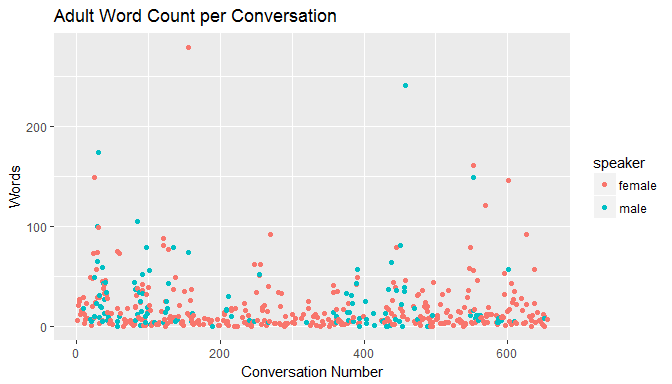
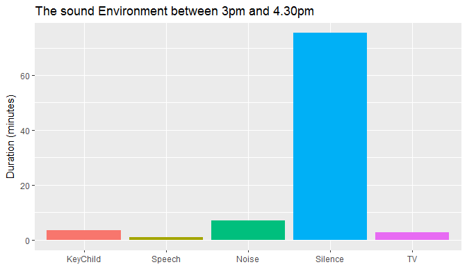

<!-- README.md is generated from README.Rmd. Please edit that file -->
rlena
=====


[](https://doi.org/10.5281/zenodo.3739543) [](https://www.repostatus.org/#inactive) [](https://travis-ci.org/HomeBankCode/rlena) [](https://coveralls.io/r/HomeBankCode/rlena?branch=master)

Overview
--------

The rlena package makes it easy to work with LENA `.its` files in R.

The *Language Environment ANalysis (LENA)* system produces automatic annotations for audio recordings. Its annotations can be exported as `.its` files, that contain an `xml` structure. The rlena package helps with importing and preparing `.its` files for further anlysis in R.

The `read_its_file()` fuction takes the path to an `.its` file and returns an XML object. All other functions work with this object to extract information. They return tidy data frames that can easily be manipulated with the usual tools from the tidyverse:

-   `gather_recordings()` - Returns all `<Recording>` nodes
-   `gather_blocks()` - Returns all `<Conversation>` and `<Pause>` nodes
-   `gather_conversations()`- Returns all `<Conversation>` nodes
-   `gather_pauses()` - Returns all `<Pause>` nodes
-   `gather_segments()` - Returns all `<Segment>` nodes
-   `gather_ava_info()` - Returns AVA (Automatic Vocalization Assessment) info
-   `gather_child_info()` - Returns child info (e.g. birth data, age, gender)

:warning: ***Warning:** This package is early work in progress and subject to potentially code-breaking change.*

Installation
------------

``` r
# rlena is not (yet) available on CRAN, but you can install the developmental 
# version from GitHub (requires devtools):
if(!require(devtools) install.packages("devtools")
devtools::install_github("HomeBankCode/rlena", dependencies = TRUE)
```

Usage
-----

-   Load an `.its` file. For this example we download a file from [HomeBankCode/lena-its-tools](https://github.com/HomeBankCode/lena-its-tools).

``` r
library(rlena)
library(dplyr, warn.conflicts = FALSE)

# Download the example ITS file
url <- "https://cdn.rawgit.com/HomeBankCode/lena-its-tools/master/Example/e20160420_165405_010572.its"
tmp <- tempfile()
download.file(url, tmp)
its <- read_its_file(tmp)
```

-   Extract child info and results of the Automatic Vocalization Assessment (an index of the child's language development).

``` r
gather_child_info(its)
#> # A tibble: 1 x 6
#>   itsId         Birthdate  Gender ChronologicalAge AVAModelAge VCVModelAge
#>   <chr>         <date>     <chr>  <chr>            <chr>       <chr>      
#> 1 20160420_165~ 2015-11-19 M      P4M              P4M         P4M

gather_ava_info(its)
#> # A tibble: 1 x 5
#>   itsId                  AVA_Raw AVA_Stnd AVA_EstMLU AVA_EstDevAge
#>   <chr>                    <dbl>    <dbl> <chr>      <chr>        
#> 1 20160420_165405_010572   0.715     111. ORL        P5M
```

-   Extract the recording information.

``` r
# Each row corresponds to an uninterrupted recording. There is a long pause 
# inbetween the two recordings. This means, that the LENA recorder was paused.
recordings <- gather_recordings(its)
recordings
#> # A tibble: 2 x 9
#>   itsId    recId startTime endTime startClockTime      endClockTime       
#>   <chr>    <int>     <dbl>   <dbl> <dttm>              <dttm>             
#> 1 2016042~     1        0    4037. 2016-04-02 17:20:30 2016-04-02 18:27:47
#> 2 2016042~     2     4037.  22575. 2016-04-02 21:48:07 2016-04-03 02:57:05
#> # ... with 3 more variables: timeZone <chr>, startClockTimeLocal <dttm>,
#> #   endClockTimeLocal <dttm>
```

-   Extract all conversations.
  - (FYI to save others the trouble: the Conversational Turn Count LENA generates (CTC) is the sum of turnTaking of type AICF, AICM, CIC, and XIC)
    e.g. conversations %>% group_by(type) %>% summarise(sumturns = sum(turnTaking))

``` r
# Each row of the returned data frame corresponds to
# one conversation node in the `.its` file. The columns contain the node's
# attributes, such as the number of adult words and child vocalizations.
conversations <- gather_conversations(its)
conversations
#> # A tibble: 655 x 48
#>    itsId               recId blkId blkTypeId blkType     startTime endTime
#>    <chr>               <int> <int>     <int> <chr>           <dbl>   <dbl>
#>  1 20160420_165405_01~     1     2         1 Conversati~      12.3    15.8
#>  2 20160420_165405_01~     1     4         2 Conversati~      21.2    27.8
#>  3 20160420_165405_01~     1     6         3 Conversati~      34.2    50.0
#>  4 20160420_165405_01~     1     8         4 Conversati~      71.7    79.8
#>  5 20160420_165405_01~     1    10         5 Conversati~      93.5   101. 
#>  6 20160420_165405_01~     1    12         6 Conversati~     111.    124. 
#>  7 20160420_165405_01~     1    14         7 Conversati~     132.    140. 
#>  8 20160420_165405_01~     1    16         8 Conversati~     151.    162. 
#>  9 20160420_165405_01~     1    18         9 Conversati~     177.    192. 
#> 10 20160420_165405_01~     1    20        10 Conversati~     198.    199. 
#> # ... with 645 more rows, and 41 more variables: startClockTime <dttm>,
#> #   endClockTime <dttm>, startClockTimeLocal <dttm>,
#> #   endClockTimeLocal <dttm>, type <chr>, average_dB <dbl>, peak_dB <dbl>,
#> #   turnTaking <int>, femaleAdultInitiation <int>,
#> #   maleAdultInitiation <int>, childResponse <int>, childInitiation <int>,
#> #   femaleAdultResponse <int>, maleAdultResponse <int>,
#> #   adultWordCnt <dbl>, femaleAdultWordCnt <dbl>, maleAdultWordCnt <dbl>,
#> #   femaleAdultUttCnt <int>, maleAdultUttCnt <int>,
#> #   femaleAdultUttLen <dbl>, maleAdultUttLen <dbl>,
#> #   femaleAdultNonSpeechLen <dbl>, maleAdultNonSpeechLen <dbl>,
#> #   childUttCnt <int>, childUttLen <dbl>, childCryVfxLen <dbl>, TVF <dbl>,
#> #   FAN <dbl>, OLN <dbl>, SIL <dbl>, NOF <dbl>, CXF <dbl>, OLF <dbl>,
#> #   CHF <dbl>, MAF <dbl>, TVN <dbl>, NON <dbl>, CXN <dbl>, CHN <dbl>,
#> #   MAN <dbl>, FAF <dbl>
```

-   Plot male and female adult word counts.

``` r
library(tidyr)
library(ggplot2)

# Create long data-frame of word counts
word_counts <- conversations %>% 
  select(conversation_nr = blkTypeId,
         time = startClockTimeLocal,
         female = femaleAdultWordCnt, 
         male = maleAdultWordCnt) %>% 
  gather(key = speaker, value = count, female, male) %>% 
  filter(count != 0)

# Add acumulated word count
word_counts <- word_counts %>%
  group_by(speaker) %>% 
  arrange(conversation_nr) %>%
  mutate(count_acc = cumsum(count))

# Plot word counts per conversations
word_counts %>%
  ggplot(aes(conversation_nr, count, color = speaker)) + 
    geom_point() + 
    labs(title = "Adult Word Count per Conversation",
         x = "Conversation Number",
         y = "Words")
```



``` r
# Plot accumulating word count over time
word_counts %>%
  ggplot(aes(time, y = count_acc, color = speaker)) + 
    geom_rect(data = recordings, inherit.aes = FALSE,
              aes(xmin = startClockTimeLocal, xmax = endClockTimeLocal, 
                  ymin=0, ymax = max(word_counts$count_acc), group = recId,
                  fill = "recorder on"), alpha=0.2) + 
    scale_fill_manual(NULL, values = 'skyblue')  +
    geom_line() + 
    labs(title = "Accumulated Adult Word Count throughout Recording",
         x = "Time",
         y = "Words (Accumulated)")
```


-   What happened between 3pm and 4.30pm? We can have a closer look at the segments to see what happened.

``` r
library(lubridate)
#> 
#> Attaching package: 'lubridate'
#> The following object is masked from 'package:base':
#> 
#>     date

# extract segments
segments <- gather_segments(its) %>% 
  filter(startClockTimeLocal >= ymd_hms("2016-04-02 15:00:00"),
         startClockTimeLocal <= ymd_hms("2016-04-02 16:30:00"))

segments 
#> # A tibble: 837 x 55
#>    itsId       recId blkId blkTypeId segId blkType spkr  startTime endTime
#>    <chr>       <int> <int>     <int> <int> <chr>   <chr>     <dbl>   <dbl>
#>  1 20160420_1~     2   592       297  5842 Pause   CHF       8383.   8383.
#>  2 20160420_1~     2   592       297  5843 Pause   SIL       8383.   8384.
#>  3 20160420_1~     2   592       297  5844 Pause   SIL       8384.   8385.
#>  4 20160420_1~     2   592       297  5845 Pause   SIL       8385.   8386.
#>  5 20160420_1~     2   592       297  5846 Pause   NOF       8386.   8388.
#>  6 20160420_1~     2   592       297  5847 Pause   SIL       8388.   8390.
#>  7 20160420_1~     2   592       297  5848 Pause   TVF       8390.   8392.
#>  8 20160420_1~     2   592       297  5849 Pause   NOF       8392.   8393.
#>  9 20160420_1~     2   592       297  5850 Pause   SIL       8393.   8394.
#> 10 20160420_1~     2   592       297  5851 Pause   NOF       8394.   8395.
#> # ... with 827 more rows, and 46 more variables: startClockTime <dttm>,
#> #   endClockTime <dttm>, startClockTimeLocal <dttm>,
#> #   endClockTimeLocal <dttm>, average_dB <dbl>, peak_dB <dbl>,
#> #   recordingInfo <chr>, conversationInfo <chr>, convStatus <chr>,
#> #   convCount <int>, convTurnCount <int>, convResponseCount <int>,
#> #   convType <chr>, convTurnType <chr>, convFloorType <chr>,
#> #   femaleAdultWordCnt <dbl>, femaleAdultNonSpeechLen <dbl>,
#> #   femaleAdultUttCnt <int>, femaleAdultUttLen <dbl>, childUttCnt <int>,
#> #   childUttLen <dbl>, startUtt1 <chr>, endUtt1 <chr>,
#> #   childCryVfxLen <dbl>, startVfx1 <dbl>, endVfx1 <dbl>, startCry1 <chr>,
#> #   endCry1 <chr>, maleAdultWordCnt <dbl>, maleAdultNonSpeechLen <dbl>,
#> #   maleAdultUttCnt <int>, maleAdultUttLen <dbl>, startUtt2 <chr>,
#> #   endUtt2 <chr>, startUtt3 <chr>, endUtt3 <chr>, startUtt4 <chr>,
#> #   endUtt4 <chr>, startUtt5 <chr>, endUtt5 <chr>, startCry2 <chr>,
#> #   endCry2 <chr>, startVfx2 <chr>, endVfx2 <chr>, startUtt6 <chr>,
#> #   endUtt6 <chr>
```

``` r
segments %>%
  mutate(duration = endTime - startTime,
         Label = forcats::fct_collapse(
           spkr,
           KeyChild = c("CHN", "CHF"),
           Speech   = c("FAN", "MAN", "CXN", "FAF", "MAF", "CXF"),
           TV       = c("TVN", "TVF"),
           Noise    = c("NOF", "NON", "OLF", "OLN"),
           Silence  = c("SIL")))  %>%
  group_by(Label) %>%
  summarize(duration = sum(duration)) %>%
  ggplot(aes(Label, duration / 60, fill = Label)) + 
    geom_col(show.legend = FALSE) +
    labs(title = "The sound Environment between 3pm and 4.30pm",
         y = "Duration (minutes)", x = NULL)
```


